# Программное обеспечение по курсу
Для работы на курсе вам понадобится следующее программное обеспечение:
* <a href = "https://code.visualstudio.com/">Visual Studio Code</a>
* <a href = "https://git-scm.com/downloads">Git Bush</a>

А также зарегистрироваться на <a href = "https://github.com/">GitHub</a>

## Работа с GitHub

Создаем новый репозитарий  
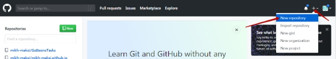  
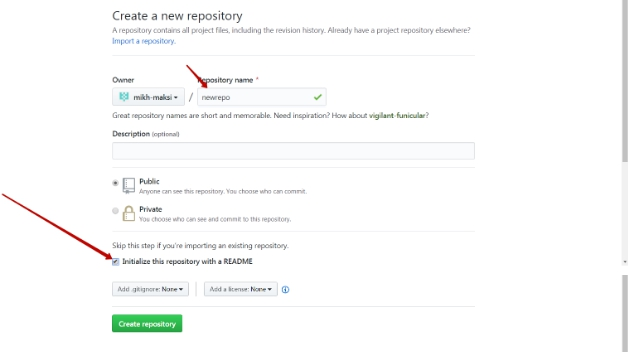  

Или используем существующий  
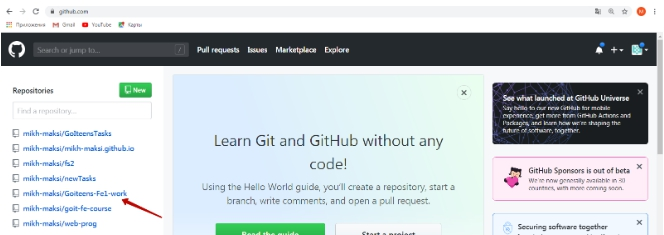  
  
Нажимаем кнопку "clone or download"  
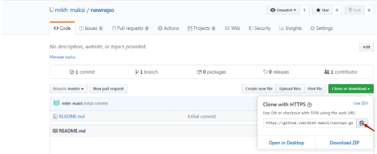  

Создаем новую папку и в ней на пустом месте нажимаем правую клавиши мыши, выбираем gitBush Here  
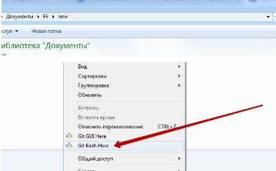  

В открывшемся окне пишем  `git clone` и нажимаем комбинацию клавиш Shift+INS  
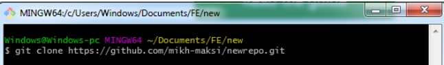  

Или нажимаем правой клавишей мыши после набранного `git clone` и выбираем "Вставить" (Paste)  
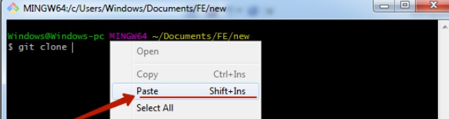  

Нажимаем "Enter"  
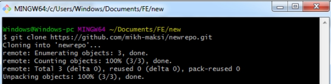  

Теперь в нашей созданной папке появилась новая под папка с названием таким же как название репозитария (в нашем случае newrepo)  
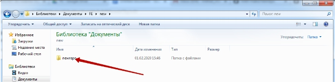  

Заходим в папку, создаем сайт (файлы index.html, style.css, картинки, шрифты, др.)  

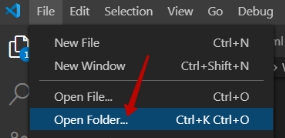  
  
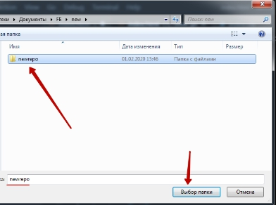  
  
Создаем необходимые файлы  
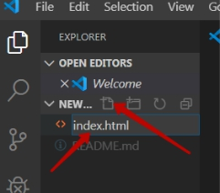  

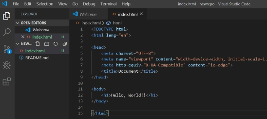  

Переходим в проводник и нажимаем правой клавишей на пустом месте и выбираем `Gitbush Here`  

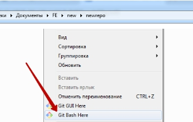  

В открывшимся окне пишем `git add .`  
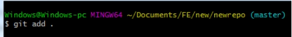  

Далее - вводим команду `git commit -m "first commit"`  

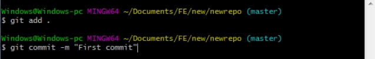  

Вводим команду `git push` (возможно - нужно будет указать логин и пароль к git hub)

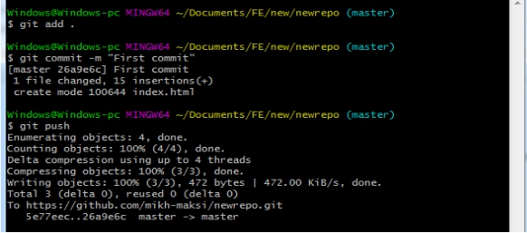  
